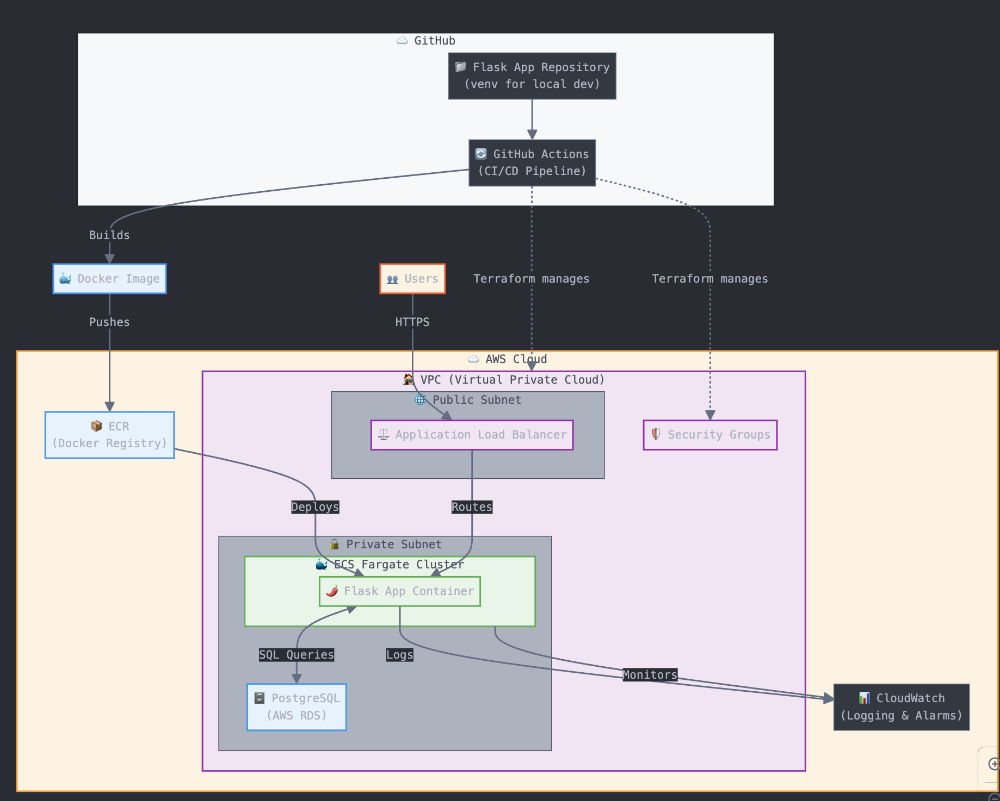

# Beer Catalog DevOps Assignment

##  Project Overview
This project demonstrates a complete DevOps workflow for a Python web application, containerized with Docker, deployed on AWS using Terraform, and automated with GitHub Actions. The solution follows 12-factor app and SOLID principles, with a focus on security, automation, and documentation.

---

## Architecture
- **Flask App** (Dockerized, venv for local dev)
- **PostgreSQL** (AWS RDS)
- **ECS Fargate** (App hosting)
- **ECR** (Docker image registry)
- **VPC, Subnets, Security Groups** (Terraform-managed)
- **CloudWatch** (Logging & Alarms)
- **GitHub Actions** (CI/CD)



---

## Local Development

### 1. Clone the repository
```sh
git clone git@github.com:alex-504/devops-test-master.git
cd devops-test-master/app/beer_catalog
```

### 2. Set up a virtual environment and install Poetry
```sh
python3 -m venv venv
source venv/bin/activate
pip install poetry
```

### 3. Install dependencies with Poetry
```sh
poetry install
```

---

### 4. Run the app with SQLite (quick start, no setup needed)
```sh
export DATABASE_URL="sqlite:///beers.db"
poetry run python -m flask --app beer_catalog/app run --debug
```
- The app will be available at [http://127.0.0.1:5000](http://127.0.0.1:5000).

---

### 5. Run the app with PostgreSQL

**Prerequisites:**
- PostgreSQL installed (e.g., `brew install postgresql@14` on macOS)
- Start PostgreSQL (macOS/Homebrew):
  ```sh
  brew services start postgresql@14
  # or for other versions:
  # brew services start postgresql
  ```
- Check status:
  ```sh
  brew services list
  ```
- Create the database (if not already created):
  ```sh
  createdb beer_catalog
  ```
  - If you see an error like `database "beer_catalog" already exists`, you can skip this step.

**Set the DATABASE_URL environment variable:**
- The default user is usually your macOS username (e.g., `alexandrevieira`).
- If you use a password, add it after the username: `postgresql://<user>:<password>@localhost:5432/beer_catalog`

```sh
export DATABASE_URL="postgresql://<user>@localhost:5432/beer_catalog"
```

**Run the app:**
```sh
poetry run python -m flask --app beer_catalog/app run --debug
```
- The app will be available at [http://127.0.0.1:5000](http://127.0.0.1:5000).

---

### Testing Endpoints
- Health check:  
  ```sh
  curl http://127.0.0.1:5000/health
  ```
- Get all beers:  
  ```sh
  curl http://127.0.0.1:5000/beers
  ```
- Add a beer:  
  ```sh
  curl -X POST http://127.0.0.1:5000/beers \
    -H "Content-Type: application/json" \
    -d '{"name": "Heineken", "style": "Lager", "abv": 5.0}'
  ```

---

## Running the App with Docker

You can run the app locally using Docker, just like in production (ECS). This ensures consistency and lets you test the container before deploying.

### 1. Build the Docker image
```sh
docker build -t beer-catalog-app .
```

### 2. Run the app with SQLite (no extra setup needed)
```sh
docker run -p 5000:5000 beer-catalog-app
```
- The app will be available at [http://localhost:5000](http://localhost:5000).

### 3. Run the app with PostgreSQL (macOS/Windows)
If you want to use your local PostgreSQL database with Docker:
```sh
docker run -p 5000:5000 -e DATABASE_URL="postgresql://<user>@host.docker.internal:5432/beer_catalog" beer-catalog-app
```
- Replace `<user>` with your Postgres username.
- If you use a password, add it after the username.
- The app will be available at [http://localhost:5000](http://localhost:5000).

> **Note:** This is the same Docker image that is pushed to ECR and used by ECS in production, ensuring consistency between local and cloud environments.

---

## ☁️ Deploying to AWS

> **Note:**
> An example `terraform.tfvars.example` file is provided in the `terraform/` directory.  
> **Copy it to a new file called `terraform.tfvars` and update the values with your own secrets and settings before running `terraform apply`.**

### 1. Build & Push Docker Image
- Automated via GitHub Actions on push to `main`, `master`, `feature/*` branches.

### 2. Provision Infrastructure
```sh
cd terraform
terraform init
terraform plan
terraform apply
```
- All AWS resources (ECR, ECS, RDS, VPC, etc.) are created from scratch (no prebuilt modules).

### 3. App Access
- App will be available at the ECS public IP (see ECS task details in AWS Console).

---

## CI/CD Pipeline (workflows/docker-ecr.yml)
- **Pull Request Checks:** Linting and (optional) tests on every PR.
- **Docker Build & Push:** On merge to `main`, `master`, `feature/*` branches, image is built and pushed to ECR.
- **ECS Deployment:** ECS service is updated with the new image.
- **Push image to ECR:** On push, the new image is built and pushed to ECR.
- **Deploy app to ECS:** ECS service is updated with the new image.

The workflows are define on `.github/workflows/` folder.

---

## Terraform Infrastructure
- **ECR repository** for Docker images
- **ECS cluster & service** for app hosting
- **RDS PostgreSQL instance**
- **VPC, subnets, security groups** (built from scratch)
- **CloudWatch log group & alarms**
- **No prebuilt modules used for ECS or networking**

---

## API Endpoints
| Method | Endpoint         | Description         |
|--------|------------------|--------------------|
| GET    | /health          | Health check       |
| GET    | /beers           | List all beers     |
| POST   | /beers           | Add a new beer     |
| POST   | /seed            | Seed database      |

> **Note:** No `/beers/<id>` endpoint as per the original app.

---

## Best Practices & Gotchas
- **Intentional Issues:** Documented and fixed in `ISSUES_FOUND.md`.
- **12-factor & SOLID:** Environment variables, logging, error handling, and code structure.
- **Security:** IAM roles, least privilege, no hardcoded secrets.
- **Naming & Structure:** Consistent resource names, clear separation of concerns.

---

## Monitoring & Logging
- **CloudWatch Logs:** ECS task logs
- **CloudWatch Alarms:** RDS high CPU, ECS task failures

---

## Screenshots of AWS Console
(All rerouces were created from scratch and provisioned using Terraform)
### AWS Console: 
* [ECS cluster](https://loom.com/i/6ef15cfc31134456a40189fdb4cdd986), 
* [ECS Logs](https://loom.com/i/dbc136a6fc3c4658936bb742ad26fa3f), 
* [RDS PostgreSQL DB](https://loom.com/i/02449ce6b4c049f2b55c28304dae4a30),
* [RDS Monitoring](https://loom.com/i/4140cdba78774d3c8a2e7efa9ea67176), 
* [RDS User Permission Setup](https://loom.com/i/03da3cd136f541999745a76d89171b06), 
* [VPC](https://loom.com/i/a03bed3225d74aebb01bbaa0044307b3), 
* [CloudWatch log events](https://loom.com/i/a77189d4c7fb4de6b398535894c5cee6), 
* [CloudWatch Alarms](https://loom.com/i/047193a0a7e84e81b2dd2b0b98997666)
### App endpoints tested via 'curl'
- health Check:  `curl http://3.27.247.99:5000/health` -> [screenshot](https://www.loom.com/i/488f3093723d48c1945b88fae43526ae)
- get all beers: curl `http://3.27.247.99:5000/beers` -> [screenshot](https://loom.com/i/1a78218075ae481782c82a44a2862176)
- add a beer: `curl -X POST http://3.27.247.99:5000/beers -H "Content-Type: application/json" -d '{"name": "Heineken", "style": "Lager", "abv": 5.0}'` -> [screenshot](https://loom.com/i/2f445224a9ea41a79ebdce70c24ac064)
- ❌ seed the database: `curl -X POST http://3.27.247.99:5000/seed` -> [screenshot](https://loom.com/i/79f75d35e15345d381e3f7e318017c9f)

### CI/CD pipeline runs
- [PR Checks](https://loom.com/i/6f4d55c60d0747959f1fe52062a4dbca)
- [Build and Push Docker Image to ECR](https://loom.com/i/243f707b845c4e91bed08453d95296dd)
- [ECR Repository](https://loom.com/i/56434a184635491994c211caa5c81627)
- [ECS Service](https://loom.com/i/3e1cdec272854f52b8aeff94fa1fea3e)
- [ECR Tasks Overview](https://loom.com/i/c068637d241b44b8af4b4936094e3bb7)


---

## Troubleshooting & Common Issues
- **Region Mismatch:** Ensure AWS CLI and Console are set to `ap-southeast-2`.
- **Resource Already Exists:** Delete or import orphaned resources.
- **App Not Responding:** Check ECS task status, security groups, and logs.
- **Terraform State Issues:** Use `terraform import` or clean up resources as needed.

---

## Evaluation Points
- **Infrastructure design:** Built for scalability and team collaboration.
- **Naming & documentation:** Clear, standardized, and recruiter-friendly.
- **CI/CD pipeline:** Automated, reliable, and secure.
- **Resilience & security:** Follows AWS and DevOps best practices.
- **Troubleshooting:** All intentional issues found and documented.

---

## Bonus Features (status)
- [✓] RDS user/permission automation. Refer to `aws_db_instance`, `aws_db_user`, `aws_db_parameter_group`, or `aws_db_role`
- [✓] Secret management. Refer to `terraform.tfvars`
- [X] ECS Service Auto Scaling. I did not have time to implement this since it required very specific configuration on AWS and loadbalancer.

---

## Next Steps / Improvements
- Add `/beers/<id>` endpoint
- Add authentication/authorization
- Use Terraform modules for larger projects
- Add automated integration tests
- ECS Service Auto Scaling
- Add ECR Lifecycle policy: to restrict the number of images in the repository. It would limit the growth of images in the repository.

---


## Minor Personal Notes
- Time Investment notes: ~2h to complete the full AWS Deployment.
- I would like to have tested more the CI/CD pipeline.
- Cost optimization: I created a [budget Status](https://loom.com/i/e293bf96e91d4b7799a8987bb9943d7f) on AWS Console, to avoid unexpected costs.
- I would like to have added a deletion protection on RDS instance (`deletion_protection = var.environment == "prod" ? true : false`), maybe next time.

## Contact
Alexandre Vieira  
[https://www.linkedin.com/in/alexandre-dev/]


